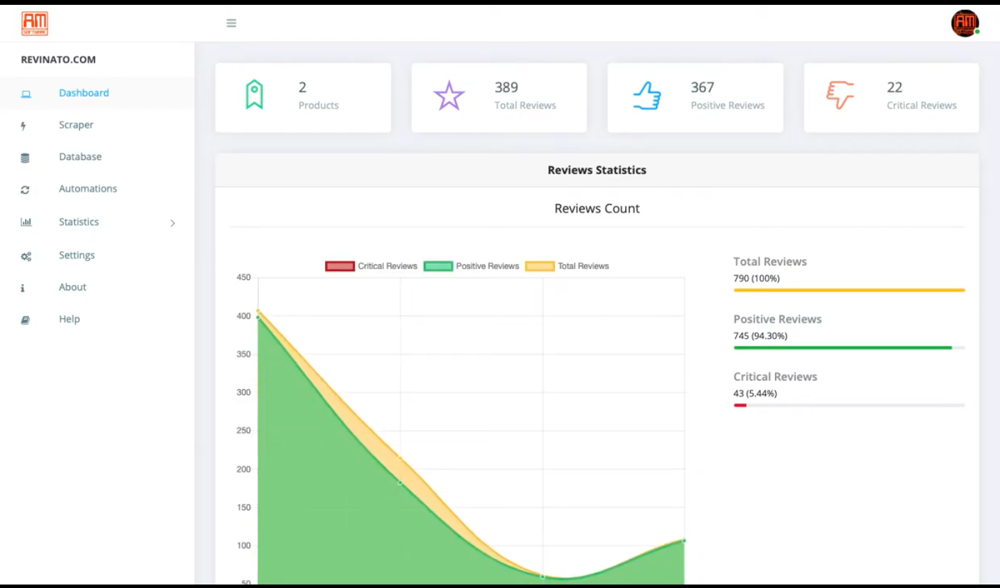
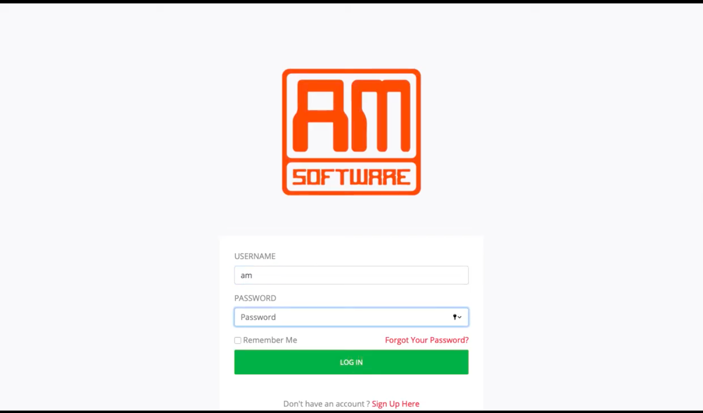
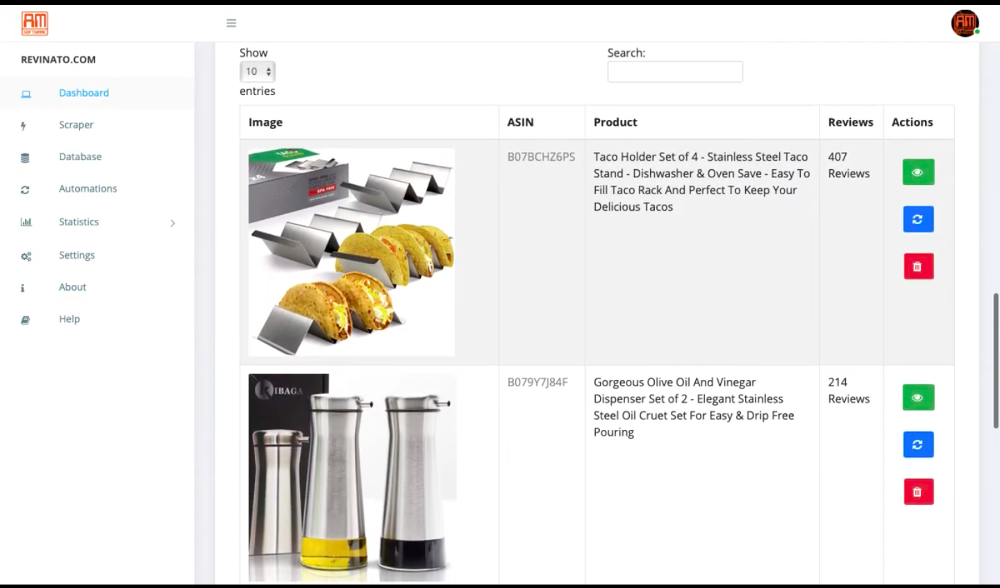

# Revinato

## Overview
This is the third major iteration of the [Revinato](https://github.com/AndresMontenegroArguello/AM-Software/Projects/ASINWebScraper) that I developed from scratch and this includes a web applicationdeveloped with Python3 and Django, connected to a SQLite 3 Database Backend, with many front-end technologies. It includes many more features besides the core web scraper features, such as statistics, email notifications, and many more.

## Screenshots

## Demos

[Revinato Demo 1](https://www.youtube.com/watch?v=dZzDyt87i6M)

[Revinato Demo 2](https://www.youtube.com/watch?v=EOTO5DHB95w)

[Revinato Demo 3](https://www.youtube.com/watch?v=UGwY7zntxyg)

[Revinato Demo 4](https://www.youtube.com/watch?v=HdvuvIP54yA)

[Revinato Demo 5](https://www.youtube.com/watch?v=20RLuXt6r80)

[Revinato Demo 6](https://www.youtube.com/watch?v=vqBMpkuutGk)

[Revinato Demo 7](https://www.youtube.com/watch?v=z7PZeWHoLwA)

[Revinato Demo 8](https://www.youtube.com/watch?v=mJRSNALlKEY)

## Author
Written by Andrés Montenegro Argüello <<am@amsoftware.co>>, June 2020.

## License
Copyright © Andrés Montenegro Argüello <<am@amsoftware.co>>, AM Software <<http://www.amsoftware.co>> - All Rights Reserved.

Unauthorized copying of this software, via any medium is strictly prohibited.

Proprietary and confidential.

Written by Andrés Montenegro Argüello <<am@amsoftware.co>>, June 2020.